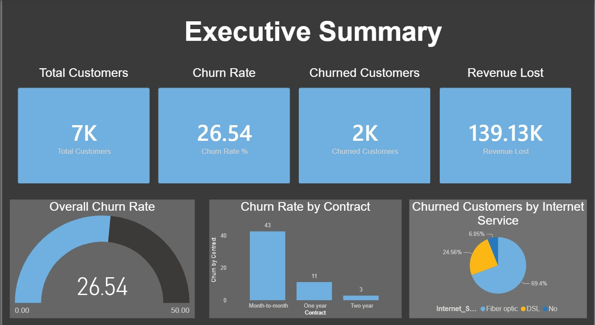
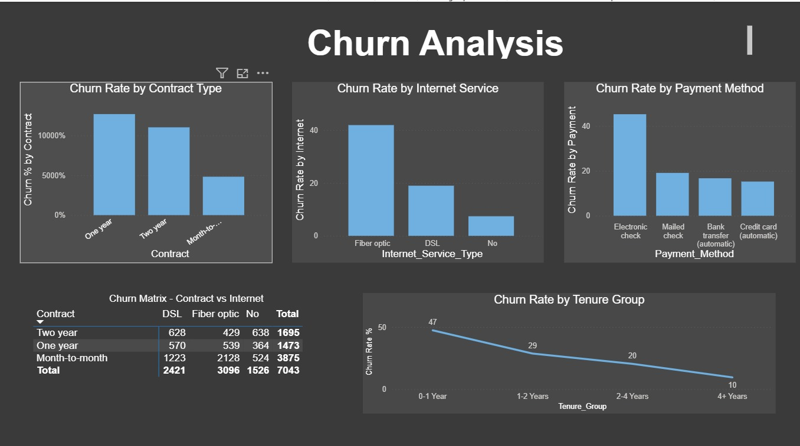
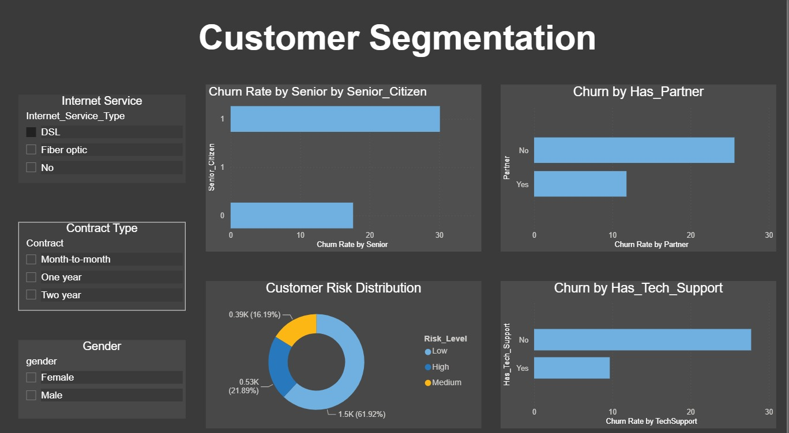

# 📊 Telecom Customer Churn Analysis

## 📌 Project Overview

An interactive Business Intelligence dashboard analyzing customer churn for a telecom company. The project identifies key churn drivers and provides actionable retention recommendations.

**Objective:** Reduce customer churn rate by 5% annually, saving $500K+.

---

## 🛠️ Tools Used

| Tool | Purpose |
|------|---------|
| **Power BI** | Interactive Dashboard & Visualizations |
| **MySQL** | Data Analysis & SQL Queries |
| **Excel** | Initial Data Exploration |
| **Draw.io** | Diagrams & Documentation |

---

## 📊 Dashboard Pages

### Page 1: Executive Summary


- KPI Cards: Total Customers, Churn Rate, Churned Customers, Revenue Lost
- Gauge Chart: Overall Churn Rate
- Bar Chart: Churn by Contract
- Pie Chart: Churn by Internet Service

### Page 2: Churn Analysis


- Churn by Contract Type
- Churn by Internet Service
- Churn by Payment Method
- Churn Matrix (Contract vs Internet)
- Churn by Tenure Group

### Page 3: Customer Segmentation


- Churn by Senior Citizen
- Churn by Tech Support
- Customer Risk Distribution
- Churn by Partner Status
- Slicers: Contract, Internet Service, Gender

---

## 🔍 Key Insights

| Metric | Value |
|--------|-------|
| Total Customers | 7,043 |
| Churn Rate | 26.54% |
| Churned Customers | 1,869 |
| Revenue Lost (Monthly) | $139.13K |

### Churn Drivers
| Driver | Insight |
|--------|---------|
| Contract | Month-to-month: 42.7% churn |
| Internet | Fiber optic: 35.0% churn |
| Payment | Electronic check: 45.3% churn |
| Tenure | New customers: 50.5% churn |
| Tech Support | No support: 39.5% churn |

---

## 💡 Business Recommendations

### Contract Strategy
- ✅ Month-to-month → 12-month contract (5-10% discount)
- ✅ Loyalty program for 2-year contracts

### Service Quality
- ✅ Improve fiber optic service quality
- ✅ Free tech support for first 6 months

### Payment Method
- ✅ Auto-pay incentive ($5 monthly discount)
- ✅ Paperless billing incentive ($3 discount)

### New Customer Retention
- ✅ Welcome program (first 3 months)
- ✅ Satisfaction survey at month 3

---

## 📁 Repository Structure
telecom-churn-analysis/
│
├── data/
│ └── telco_churn.csv
│
├── sql/
│ └── churn_analysis_queries.sql
│
├── powerbi/
│ └── Telecom_Churn_Analysis.pbix
│
├── images/
│ ├── dashboard_page1.png
│ ├── dashboard_page2.png
│ └── dashboard_page3.png
│
├── documentation/
│ ├── BRD_Churn_Analysis.docx
│ ├── Insights_Report.docx
│ └── User_Stories.docx
│
├── README.md
└── .gitignore


---

## 🚀 How to Run

### Prerequisites
- Power BI Desktop (Free download)
- MySQL Server (Free download)

### Steps

**1. Clone the repository**
```bash
git clone https://github.com/RomeshikaDewmini/telecom-churn-analysis.git
